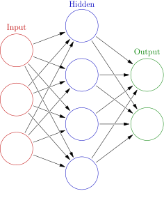
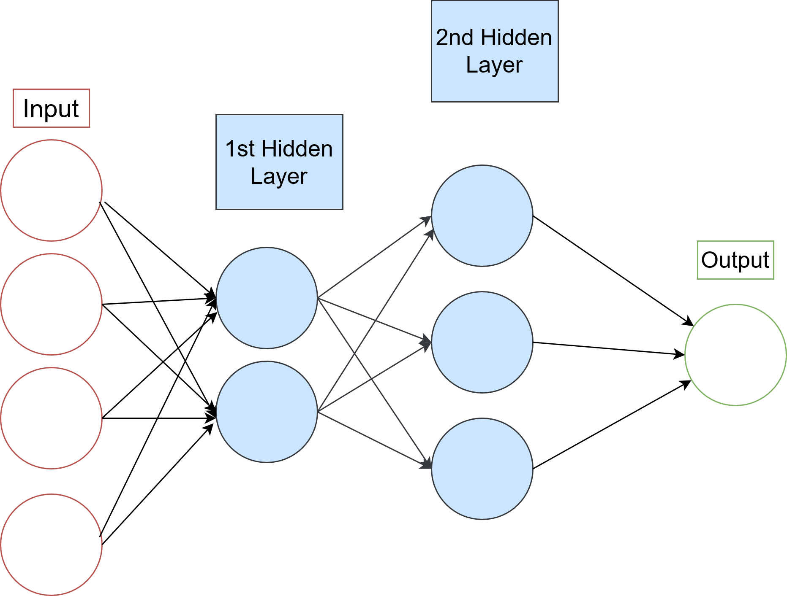
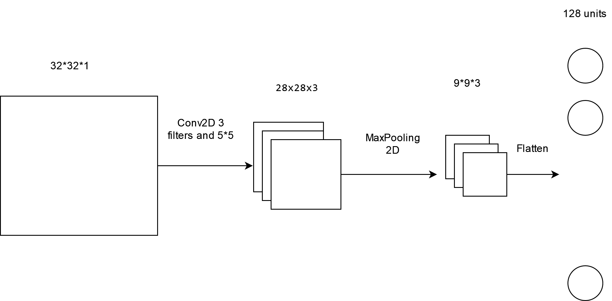

## Homework 4
This homework is due on 04/29/2024 by 11:59 PM. Homework 4 is about deep neural network.

### Question 1 
Consider a neural network with two hidden layers: $p=4$ input units, $2$ units in the first hidden layer, $3$ units in the second hidden layer, and a single output.

(a) Draw a picture of the network, similar to the following: 

(b) Write out an expression for $f(X)$, assuming ReLU activation functions. Be as explicit as possible.

The three layers (from our final output layer back to the start of our network)
can be described as:

$$
\begin{align*}
f(X) &= g(w_{0}^{(3)} + \sum_{l=1}^{K_2} w_{l}^{(3)} A_l^{(2)}) \\
A_l^{(2)} &= h_l^{(2)}(X) = g(w_{l0}^{(2)} + \sum_{k=1}^{K_1} w_{lk}^{(2)} A_k^{(1)}) \\
A_k^{(1)} &= h_k^{(1)}(X) = g(w_{k0}^{(1)} + \sum_{j=1}^p w_{kj}^{(1)} X_j)
\end{align*}
$$

for $l = 1, ..., K_2 = 3$ and $k = 1, ..., K_1 = 2$ and $p = 4$, where,

$$
g(z) = (z)_+ = \begin{cases}
0, & \text{if } z < 0 \\
z, & \text{otherwise}
\end{cases}
$$

(c) Now plug in some values for the coefficients and write out the value of $f(X)$.

Output Layer:

w_{0}^{(3)} = 1

w_{1}^{(3)} = 0.5

(d) How many parameters are there?

There are 4∗2+2+2∗3+3+3∗1+1=23 parameters.

### Question 2
Consider the *softmax* fucntion $S_k(x) = \frac{e^{x_k}}{\sum_{l=1}^{K} e^{x_l}}$ for $k=1,2,...,K$.

(a) Show that the *softmax* function is equivariant to adding an arbitrary constant to the input, that is, for any input vector $x$ and any constant $c$, 
$$S_k(x) = S_k(x+c)$$

$$ S_k(x) = \frac{e^{x_k}}{\sum_{i=1}^{N} e^{x_i}} $$

$$ S_k(x+c) = \frac{e^{x_k}}{\sum_{i=1}^{N} e^{x_i}} = S_k(x) $$

(b) Show that the *softmax* function is not equivariant to multiplying all elements of the input by a constant $c>0$, that is, for any input vector $x$ and any constant $c>0$,
$$S_k(x) \neq S_k(cx)$$
Compare the softmax function with the population probility function $P_k(x) = \frac{x_k}{\sum_{l=1}^{K} x_l}$ for $k=1,2,...,K$. Show that the population probability function is equivariant to multiplying all elements of the input by a constant $c>0$, that is, for any input vector $x$ and any constant $c>0$,
$$P_k(x) = P_k(cx)$$

To show that the softmax function is not equivariant to multiplying all elements of the input by a constant \( c > 0 \):

$$ S_k(x) = \frac{e^{x_k}}{\sum_{i=1}^{N} e^{x_i}} $$

$$ S_k(cx) = \frac{(e^{x_k})^c}{\sum_{i=1}^{N} (e^{x_i})^c} \neq S_k(x) $$

To show that the population probability function is equivariant to multiplying all elements of the input by a constant \( c > 0 \):

$$ P_k(x) = \frac{x_k}{\sum_{l=1}^{K} x_l} $$

$$ P_k(cx) = \frac{cx_k}{\sum_{l=1}^{K} cx_l} = \frac{x_k}{\sum_{l=1}^{K} x_l} = P_k(x) $$

### Question 3 
Consider a CNN that takes a $32 \times 32$ grayscale image as input. The CNN consists of a convolutional layer with $3$ filters of size $5 \times 5$, a $3 \times 3$ pooling layer, and a fully connected layer with $128$ units. (no boundary padding and stride is one)

(a) Draw a picture of the network, similar to the following:

(b) How many parameters are in this model?
Input layer: 32*32*3 = 3072 activation size and 0 parameter. 
Convolutional Layer: (5×5×1×3)+3=78 parameters 
Pooling Layer: No parameters
Fully Connected layer: (output_size x output_size) * number of neurons = (28 x 28) * 128 = 98304
Total parameters = 78 + 98432 = 98510

(c) Explain how this model can be thought of as an ordinary feedforward neural network with the individual pixel values as inputs, and with constraints on the weights in the hidden units. What are the constraints?
>CNN takes input from a selective amount of pixels. The nodes are not directly connected but they are convoluted version of the previous layer. Whereas in feed forward network the next layer is a function output of the previous layer and >takes information from all the data points. 

### Question 4 
This is optional. If you choose to answer this question, you will receive extra credit.

Think about CNN and RNN. Can you come up with a new neural network architecture that combines the two? Explain how this new architecture works and why it might be useful.
Use keras and MNIST dataset to show the performance of your new architecture.

RNN can be used at the end of the CNN where after flattening the dataset we can use RNN network connecting each neurons to another and make prediction. The flattened dataset can now be thought as an input to an RNN network. 
