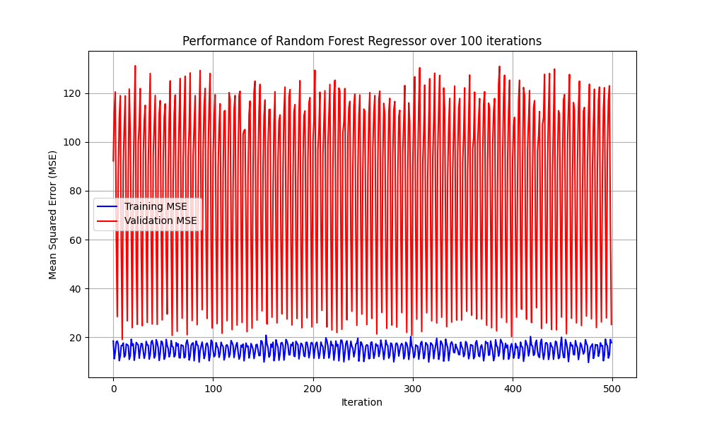
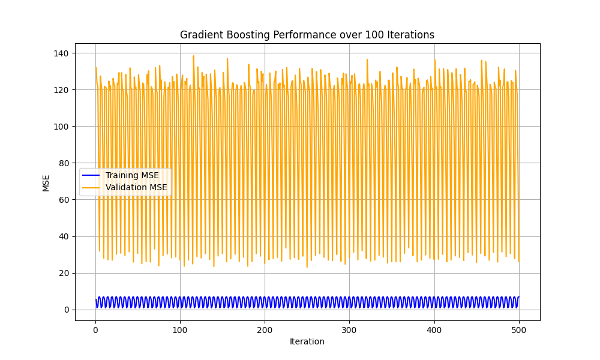
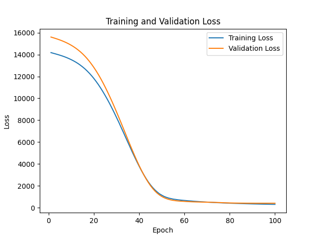
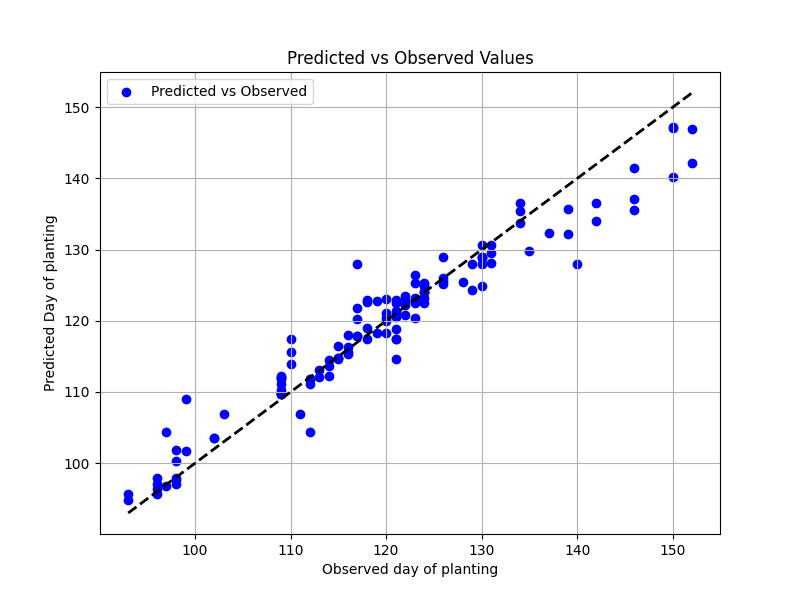

I am working with my reserach data. The dataset are timeseries dataset. In this project I am trying to predict planting dates.The features data are satelittle information. It consists of EVI which is enhanced vegetation index. The features also include tempearture and shortwave radiation data. There are 10 features which are:  
meana: the minimum EVI value before the growing season  
meanb: the minimum EVI value after the growing season  
maxevi: the maximum EVI value during the growing season  
meang1: The difference between the maxevi and meana  
meang2: The difference between the maxevi and meanb  
meandoy: the day of the year where the max evi has been reached  
meanTemp: The mean temperature of the growing season  
meanDSWR: the mean downward shortwave radation of the growing season  
meanTmax: the mean of the maximum temperature of the growing season  

Target feature:
meanDOP: Planting date of 128 rice fields obtained from the farmers 

#Code:
projects/src/SatelliteData.js: Javascript to extract information from google earth engine
projects/src/PlantingDatePrediction.ipynb: python code to model the planting and harvesting date using machine learning and deep learning algorithm

#data:
projects/data/EVIallRicefieldssummarised.csv: the dataset used for this project. It has 128 datapoints. 

We will try to predict meanDOP. We will use three algorithms Random forest, Gradient boosting, and Neural network. We split the dataset into 0.75 and 0.25 ratio and run them for 100 iterations. 

#Performance of the random forest model

#Performance of the Gradient Boosting model 

#Performance of the Artificial Neural Network

The performance of random forest was better than the other models so I want to use this model to predict the planting date of the rice plants using satellite information

Prediction of the random using all the data:

Limitations of the dataset:
This is a small dataset and the performance of the models in the testing dataset is really which means we need to collect more data in order to see the performance of the models. 
